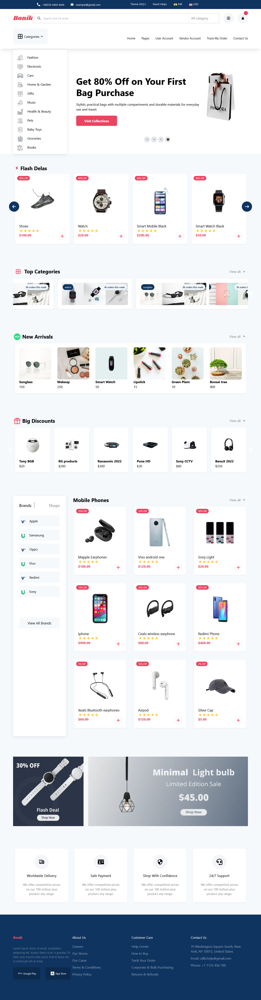

# Bonik E-commerce Website

Welcome to Bonik, your ultimate destination for online shopping!

## Features

- **Wide Range of Products**: Explore a diverse selection of high-quality items.
- **User-Friendly Experience**: Enjoy a seamless and intuitive shopping interface.
- **Responsive Design**: Access Bonik from any device, ensuring a consistent experience.
- **Fast Checkout**: Streamlined payment and checkout process for convenience.
- **Secure Transactions**: Your privacy and security are our top priorities.

## Technologies Used

- **React**: Frontend development for dynamic user interfaces.
- **React DOM**: Efficiently manages updates to the DOM for a responsive experience.
- **Tailwind CSS**: Utilized for a modern and clean design approach.

## Getting Started

To get started with Bonik locally, follow these steps:

1. Clone the repository: `git clone https://github.com/samirzjadhav/react-ecommerce-website.git`
2. Navigate to the project directory: `cd react-ecommerce-website`
3. Install dependencies: `npm install`
4. Start the development server: `npm start`
5. Open your browser and visit: `http://localhost:3000`

## Project Images

## Contributing

Contributions are welcome! If you'd like to contribute to Bonik, please follow these guidelines:

- Fork the repository and create your branch from `main`.
- Make your changes, ensuring they align with the existing code style.
- Test thoroughly and submit a pull request detailing your changes.

## Feedback

We value your feedback! If you have any suggestions or encounter any issues while using Bonik, please [open an issue](https://github.com/samirzjadhav/react-ecommerce-website/issues) on GitHub.

## License

This project is licensed under the MIT License - see the [LICENSE](LICENSE) file for details.
.
